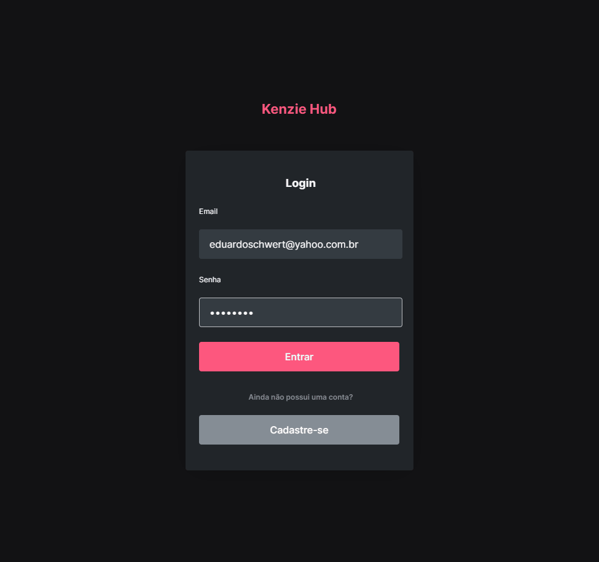

<h1 align="center">Kenzie Hub</h1>

<p align="center"></p>

<h3 align="center">Plataforma para desenvolvedores estudantes da <a href="https://kenzie.com.br/">Kenzie Academy</a>, onde permite os mesmos organizarem suas aptidões e habilidades nas tecnologias estudadas no momento e no módulo atual que estão. Foi utilizada a API <a href="https://github.com/Kenzie-Academy-Brasil-Developers/kenziehub-api">Kenzie-Hub-API</a></h3>

<h4 align="center">Status do projeto: 🚧   Concluído 🚀 🚧</h4>

<h4 align="center">Deploy da aplicação: <a href="https://s3-14-entrega-projeto-kenziehub-cadastroelogin-eduschwert.vercel.app/">Vercel</a></h4>

<h3>Features</h3>

- [x] Cadastro de desenvolvedor
- [x] AutoLogin
- [x] Criar, editar e excluir tecnologias do desenvolvedor

<h3>Pré-requisitos</h3>

Antes de começar, você vai precisar ter instalado em sua máquina as seguintes ferramentas:
[Git](https://git-scm.com), [Node.js](https://nodejs.org/en/).
Além disto é bom ter um editor para trabalhar com o código como [VSCode](https://code.visualstudio.com/)

<h3>🚀 Rodando o projeto</h3>

```bash
# Clone este repositório
$ git clone <git@github.com:eduschwert/kenzie-hub.git>

# Acesse a pasta do projeto no terminal/cmd
$ cd kenzie-hub

# Instale as dependências
$ yarn install

# Execute a aplicação
$ yarn start

# A aplicação inciará na porta:3000 - acesse <http://localhost:3000>
```

<h3>🛠 Tecnologias</h3>

As seguintes ferramentas foram usadas na construção do projeto:

- [React](https://pt-br.reactjs.org/)
- [Typescript](https://www.typescriptlang.org/)
- [Styled-Components](https://styled-components.com/)
- [Yup](https://www.npmjs.com/package/yup/)
- [React Hook Form](https://react-hook-form.com/)
- [Framer Motion](https://www.framer.com/motion/)
- [React Router](https://reactrouter.com/en/main)
- [Axios](https://axios-http.com/ptbr/docs/intro)

<h3>Autor</h3>


Feito por Eduardo Schwert 👋🏽 Entre em contato!

<a href="https://www.linkedin.com/in/eduardoschwert/"></a>
<a href="mailto:eduardoschwert@yahoo.com.br"></a>
